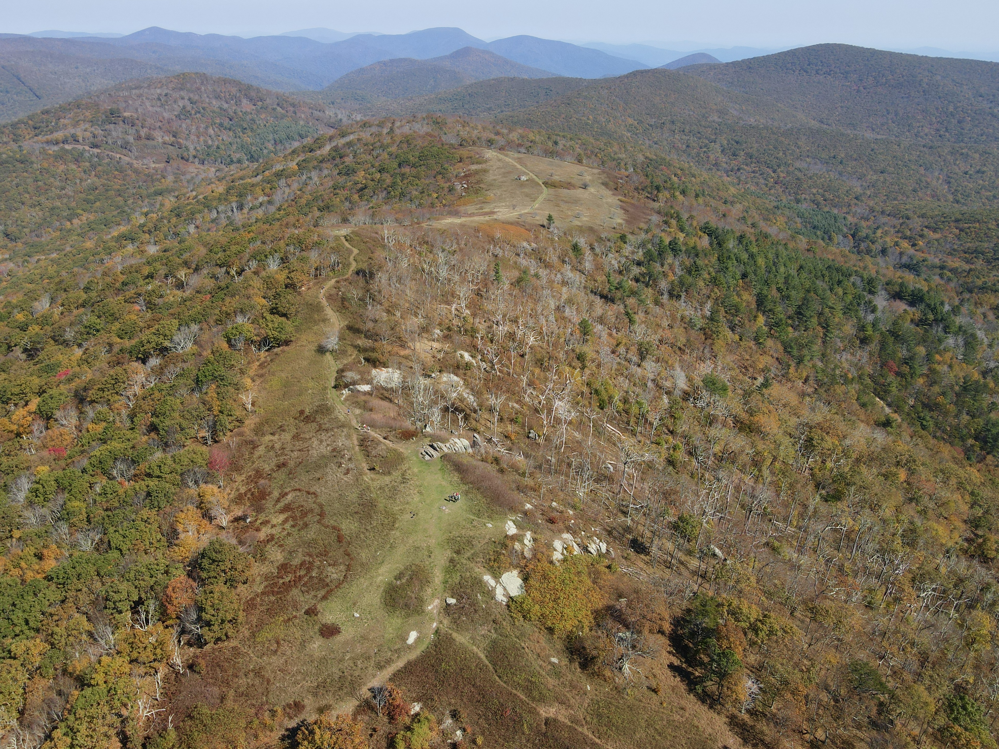
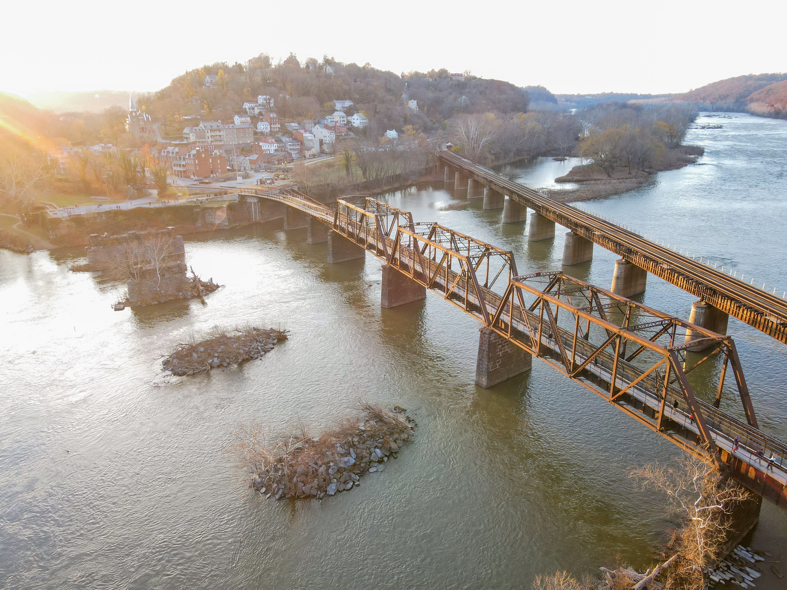
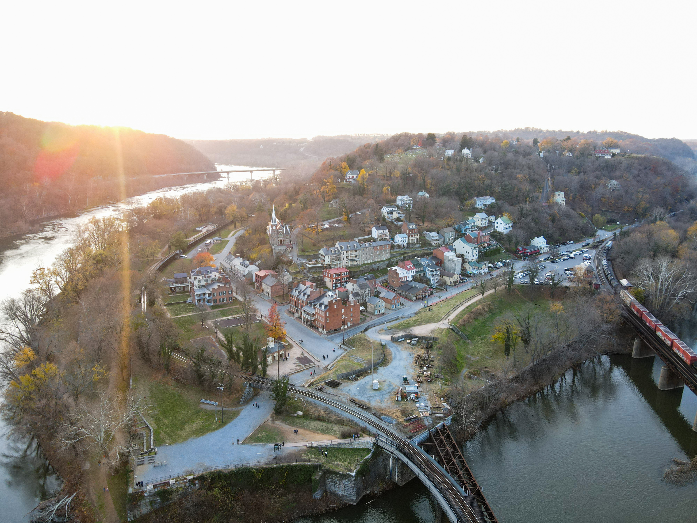

Currently Remote Pilot Certified. Got certified over Summer 2024. Had a DJI Mini 2, but upgraded to DJI Air 2 (with accessories). Has been a fantastic drone, no problems and has captured many awesome photos.

### Photos

### Drone Club
Also attended drone club where we learned about the basics of drones, how to fly, legal restrictions, and other important information relating. We also had the opportunity to map and investigate a telephone tower. The operator's job was to do so, and had the change to tag along. 

### Media

Check out my other photography/videography work: [[creative/photography/index|Photography]] · [[creative/videography|Videography]] · [[creative/my-gear|My Gear]] · [[experience/certifications|Remote Pilot Cert]]