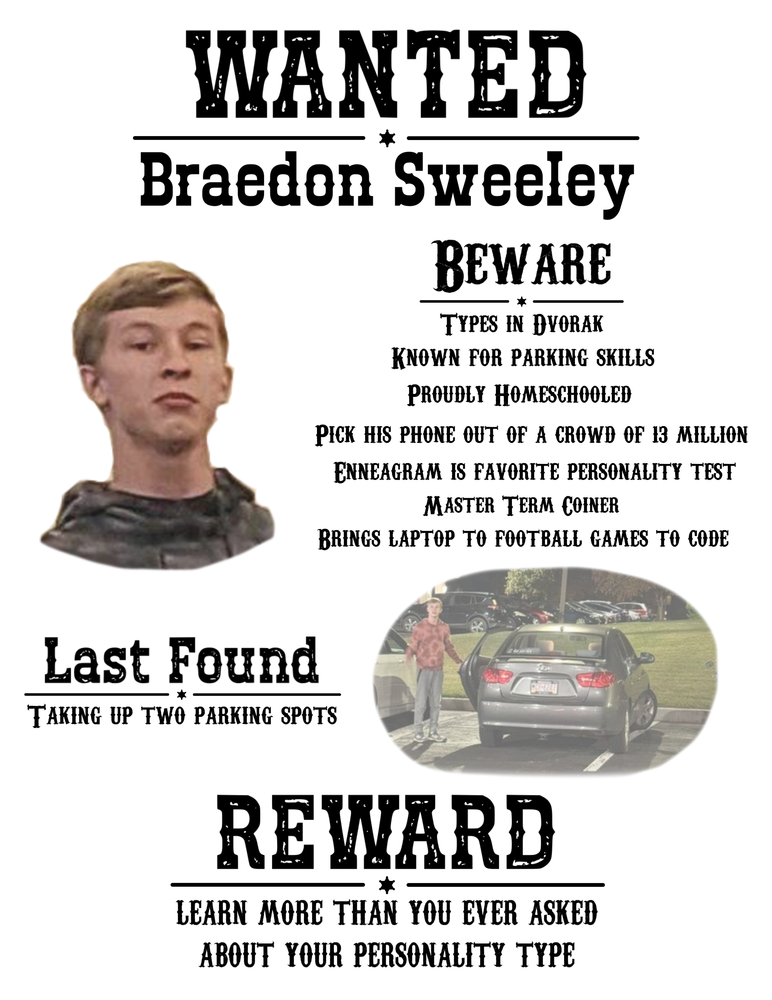
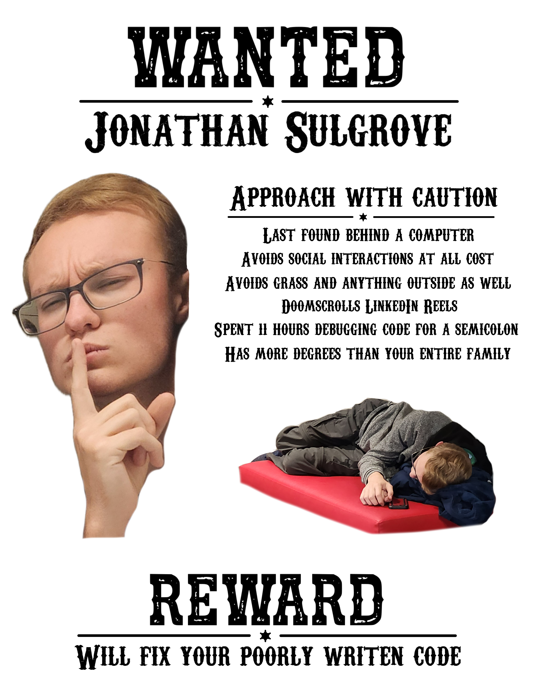
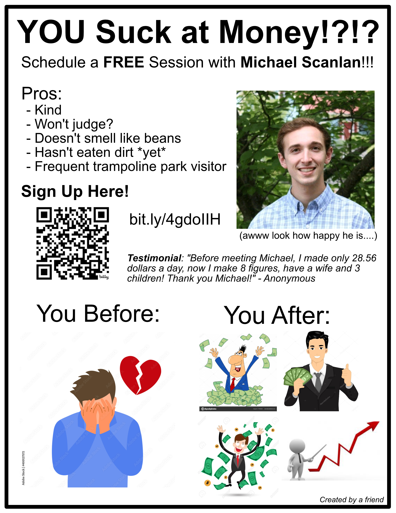
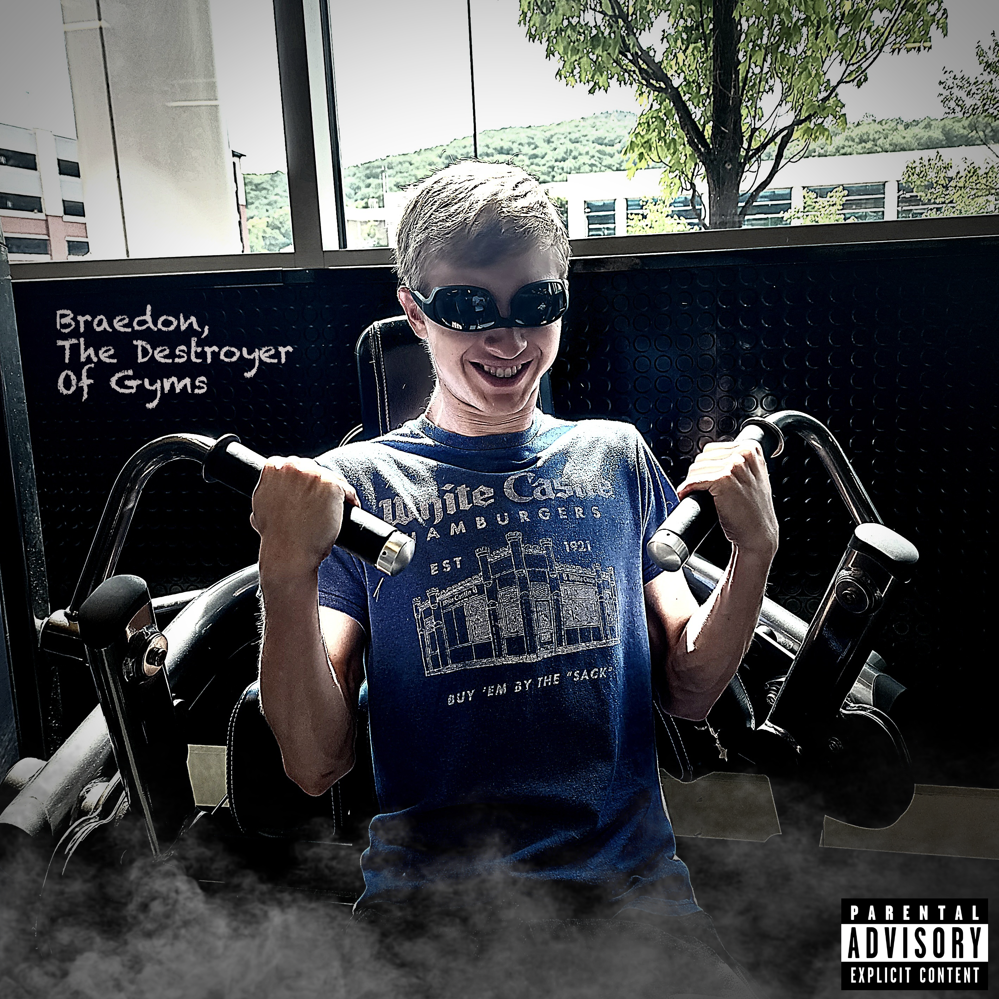
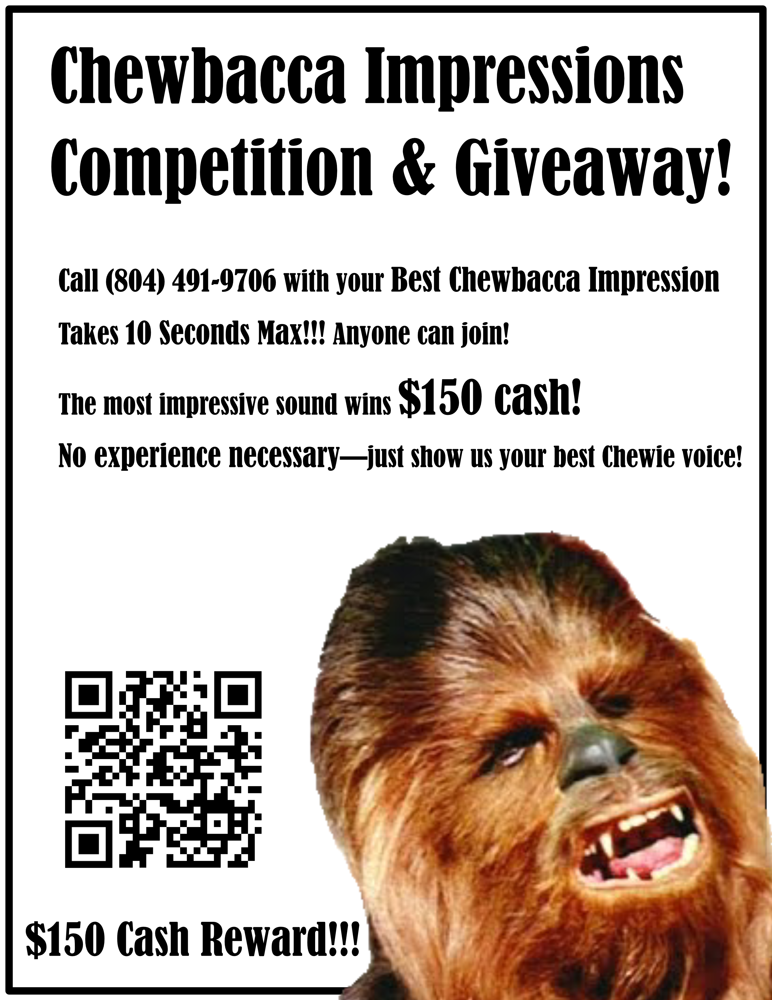

# Graphic Design

Use Affinity Designer and Photo for my current designs. Used to use Adobe suite when it was free for students including Photoshop, Lightroom, and a small bit of InDesign. Mainly do graphic design for fun. Below are some of my projects.

### Wanted Posters
Made wanted posters for my friends. Took some inside jokes and turned them into a poster. Printed out many and put them around the walls of a campus-wide event. They both got texts from their friends saying that they saw those. 

### Financial Poster
For Liberty University School of Business - Center for Financial Literacy. Also to advertise my friend so he could get even more experience.

### Album Art 
Just for fun. Friend went to the gym, and accidently broke a part of the machine (it was already broken). I took that picture and told him I would turn it into an album cover for the fun of it.

### Unreleased Poster
Never actually followed through with this one, but was a fun idea. Got it from somewhere else.

